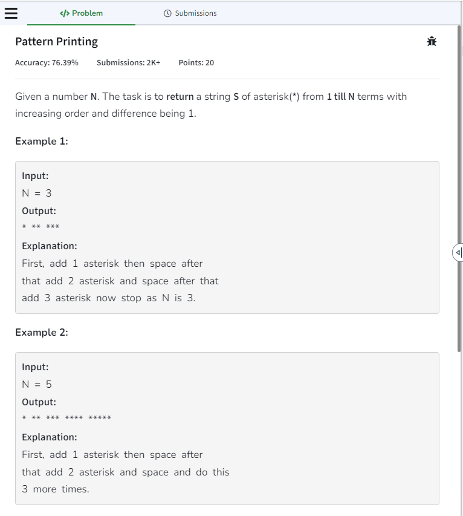

<!-- #include<bits/stdc++.h>
using namespace std;

class Solution {
  public:
    vector<char> printPattern(int N) {
        // code here
        vector<char>ans;
        for(int i = 1; i <= N; i++)
        {
            for(int j = 1; j <= i; j++)
            {
                ans.push_back('*');
            }
            ans.push_back(' ');
        }
        return ans;
    }
};

int main(){
    int t;
    scanf("%d ",&t);
    while(t--){
        
        int N;
        scanf("%d",&N);
        
        Solution obj;
        
        vector<char>ans = obj.printPattern(N);
        for(auto it : ans) {
            cout<<it;
        }
        cout<<endl;
    }
} -->